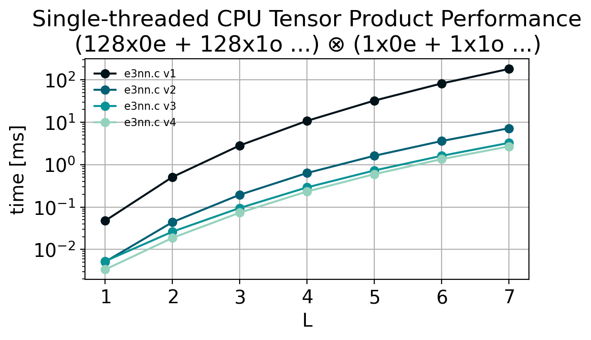

# e3nn.c

Pure C implementation of [`e3nn`](https://e3nn.org/). Mostly done for pedagogical reasons, but similar code could be used for C/C++ implementations of e3nn-based models for inference or CUDA kernels for faster operations within Python libraries.

Currently the only operations implemented are the tensor product, and spherical harmonics. 


*Single-thread CPU performance of the tensor product on an Intel i5 Desktop Processor.*

## Example

```c
// example.c
#include <stdio.h>

#include "e3nn.h"

int main(void){

    // tensor product

    float input1[] = { 0, 1, 2, 3, 4 };
    float input2[] = { 0, 1, 2, 3, 4, 5};
    float product[30] = { 0 };

    tensor_product("2x0e + 1x1o", input1, 
                   "1x0o + 1x2o", input2, 
                   "2x0o + 2x1e + 1x2e + 2x2o + 1x3e", product);

    printf("product ["); for (int i = 0; i < 30; i++){ printf("%.2f, ", product[i]); } printf("]\n");

    // spherical harmonics

    float sph[9] = { 0 };

    spherical_harmonics("1x0e + 1x1o + 1x2e", 1.0, 2.0, 3.0, sph);

    printf("sph ["); for (int i = 0; i < 9; i++) { printf("%.2f, ", sph[i]); } printf("]\n");
    
    return 0;
}
```

```shell
$ make example && ./example
product [0.00, 0.00, 0.00, 0.00, 0.00, -1.90, 16.65, 14.83, 7.35, -12.57, 0.00, -0.66, 4.08, 0.00, 0.00, 0.00, 0.00, 0.00, 1.00, 2.00, 3.00, 4.00, 5.00, 9.90, 10.97, 9.27, -1.97, 12.34, 15.59, 12.73, ]
sph [1.00, 0.46, 0.93, 1.39, 0.83, 0.55, -0.16, 1.66, 1.11, ]
```

Writes the same values to buffer `output` as the following Python code:

```python
import jax.numpy as jnp
import e3nn_jax as e3nn

input1 = e3nn.IrrepsArray("2x0e + 1x1o", jnp.arange(5))
input2 = e3nn.IrrepsArray("1x0o + 1x2o", jnp.arange(6))
product = e3nn.tensor_product(input1, input2)
print("product", product.array)

sph = e3nn.spherical_harmonics("1x0e + 1x1o + 1x2e", jnp.array([1, 2, 3]), normalize=True, normalization="component")
print("sph", sph.array)
```

## Usage

See example above and in `example.c`. Run with

```bash
make example
./example
```

Currently the output irrep must be defined manually. This could be computed on the fly with minimal computational cost, however I am not sure what makes for the best API here. Additionally, only `component` normalization is currently implemented, and it will not function properly if the output irreps do not match the full simplified output irreps (i.e. no filtering); see [Todo](#todo).

## Benchmarking

```bash
python -m ./venv
source venv/bin/activate
pip install -r extra/requirements.txt

make benchmark
```



`e3nn.c` contains several tensor product implementations, each with improvements over the previous for faster runtime.

### `v1`

`tensor_product_v1` Is a naive implementation that performs the entire tensor product for all Clebsch-Gordan coefficients:

```math
(u \otimes v)^{(l)}_m = \sum_{m_1 = -l_1}^{l_1}\sum_{m_2 = -l_2}^{l_2} C^{(l, m)}_{(l_1, m_1)(l_2, m_2)} u^{(l_1)}_{m_1}v^{(l_2)}_{m_2}
```

To minize overhead in the computation of the Clebsch-Gordan coefficients, they are pre-computed up to `L_MAX` and cached the first time the tensor product is called, creating a one-time startup cost.

### `v2`

The `tensor_product_v2` implementation leverages the fact that, even after conversion to the real basis, the Clebsch-Gordan coeffecients are generally sparse, with many entries equal to 0. To take advantage of this, we precompute a data structure that stores only the non-zero entries of $C$ at each $l_1$, $l_2$, $l$ and their corresponding index at $m_1$, $m_2$, $m$. This significantly improves performance by elminating needless operations of iterating through 0 valued coefficients. Just-in-time (JIT) compilers built into JAX and PyTorch are likely able to perform this optimization as well.

### `v3`

`tensor_product_v3` forgoes the computation of Clebsch-Gordan coefficients all together, and instead generates C code to compute the partial tensor product at every $l_1$, $l_2$, $l$ combination up to `L_MAX`. This elimates the need to iterate over any coefficients, allowing each value in the output to be written in a single step. As it as generated at compile time, the C compliler can also make optimizations to ensure the operations are fast. See `tp_codegen.py`, which generates `tp.c`, containing all of the tensor product paths.

## Todo:

 - [X] Benchmark against `e3nn` and `e3nn-jax`
 - [X] Sparse Clebsch-Gordan implementation
 - [X] Implement Spherical Harmonics
 - [ ] Implement Linear/Self-interaction operation
 - [ ] Implement `filter_ir_out` and `irrep_normalization="norm"` for tensor product
 - [ ] Full [Nequip](https://arxiv.org/abs/2101.03164), [Allegro](https://arxiv.org/abs/2204.05249), or [ChargE3Net](https://arxiv.org/abs/2312.05388) implementation
 - [ ] Implement `integral`, `norm`, and no normalization for spherical harmonics
 - [ ] ...

## See also

 * [`e3nn` PyTorch]()
 * [`e3nn-jax`](https://github.com/e3nn/e3nn-jax)
 * The `e3nn` paper: https://arxiv.org/abs/2207.09453
 * *Numerical Recipes in C, 2nd Edition* ([Press et al.](http://s3.amazonaws.com/nrbook.com/book_C210.html)) - helpful formulae and reference implementations for Legendre polynomials, Bessel functions
 * [karpathy/llama.c](https://github.com/karpathy/llama2.c) - inspo for work
